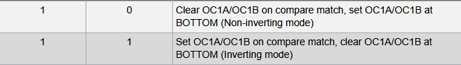

# TIMER1
- je 16-bit
## TCCR1A registr
- offset 0x80 - už venku v paměti, nutný jiný přístup

### COM1A[1:0] a COM1B[1:0] bity
- když jeden nebo oba 1, pak output OC1A overriduje normalni funkcionalitu I/O protu, k němuž je připojen, analogicky COM1B

### WGM1[1:0] bity
- **společně s WGM1[3:2] v TCCR1B registru**
- ovlivňují maximum counteru a typ waveform 

### módy
- CTC - clear timer on compare match
- NOrmal - counter
- PWM
- například pro CTC mód musím nastavit WGM1[2] a vybrat si, zda nastavím WGM1[3]
## TCCR1B registr
- offset 0x81

### ICNC1 
- input capture noise canceler
- aktivovan 1, input z capture pinu ICP1 je filtrován
- dochází ke zpoždění vstupu
### ICES1
- inpu tcapture edge select
- 0 - falling edge je event
- 1 - rising edge je event
### co způsobí capture?
- counter value se zkopiruje do ICR1 (input capture register)
- nastavi se input capture flag ICF1
- pokud je ICR1 použito jako TOP (viz tabulka výš), pak se ICP1 odpojí a capture se tím vypne

### WGM1[2:3]
- [viz tohle](#wgm1[1:0]-bity)

### CS1[2:0]
- clock select 1
- ktery clock source se pouzije 

## ICR1 registr
- input capture registr
- sem se pri capture zkopiruje hodnota timeru
- 16bit
- low a high čásst

## TCCR1C registr
- nejake dva bity pro nonpwa
## TCNT1
- samotný counter, 16it
- low a high
## OCR1A
- low a high
- 0x88
- output compare 1a, s timhle se comparuje hodntoa timeru nactena do ICR1
## OCR1B
- to stejne, akorat 1B compare

## TIMSK1
- timer interrupt mask register

### ICIE1 bit
- Input Capture Interrupt Enable
- pokud 1 a zárověň povolené interrupty globálně, je povolen input capture interrupt
- korespondujici vektor je vykonan, pokud je nastaven ICF1 flag v TIFR1
### ICIE1B  
- Output Compare B Match Interrupt Enable
- obdobně, jen OCF1B flag
### ICIE1A
- obdobně jen OCF1A flag
### TOIE1
- overfow interrupt enable
- TOV flag
## TIFR1
- timer interrupt flag register 
- **nastaví ho match**