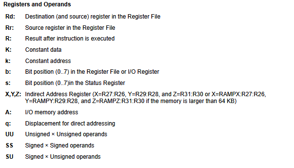
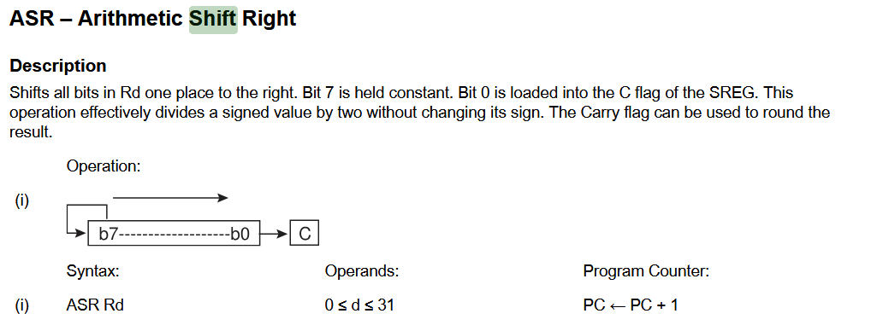
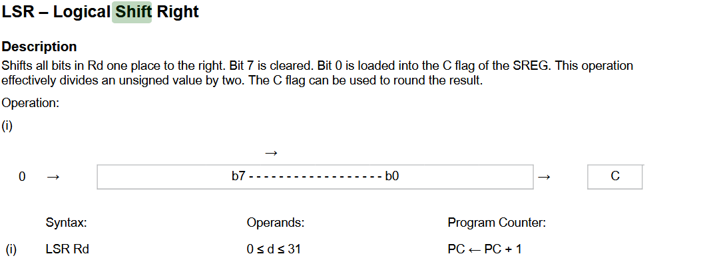

> Programování mikrokontrolerů

## vývojová prostředí
- Mikrochip Studio
- VSCOde + PlatformIO

## hardware
- možná bude potřeba opatřit si arduino

# MCU - microcontroller unit
- umí běžet sám, má nějaké vlastní hodiny, jen se zapojí a běží
## z čeho se skládá 
- procesor (MPU - microprocessor unit)
- dráty
- paměti
- ...

## historie
### Intel
- 4004 -> 8048 (MCS48)
### Texas Instruments
- TMS1000
- předek kdovíčeho, pořád se používá
- clock, processor (11+32 instr), instruction ROM (1024\*8), data RAM (64*4), I/O support
  
## architektury
### von Neumann
- jedna paměť, jedna sběrnice
### Harvard
- oddělená programová a datová paměť
- může být rychlejší, protože jsou oddělené linky
- jednodušší instr. sady

## instrukční sety
- RISC - typicky Harvard
- CISC specialitky
  
## programové paměti
- ROM (obsah dán výrobou)
- OTP (one time programmable)
- EPROM
- EEPROM
- FLASH
- externí

## datové paměti
- statické RAM - mohou běžet pomalu
- perzistentní (EEPROM, SRAM s nějakým rezervním zdrojem - vydrží až desítky let)
- externí

## I/O
- všechno

## komunikace
- všemožné sériové linky, SPI - serial peripheral interface
- I2C - sběrnice
- každé nové auto má alespoň tři CAN sběrnice, opravář se napíchne a ví, který modul vyměnit
- USB
- RSxxx

## speciální jednotky
- brown-out detection - zjistí, že umírá a rozumně se ukončí
- power-on delay - hned po sartu by tam byl náhodný obsah
- oscillator control - za běhu si můžou změnit taktovací frekvenci
- timery - nezávisle na vykonávání instrukcí 
  - watchdog timer - **hlídací pes, kterej, když ho nekrmíte, tak vás pokouše**, když ho jednou za čas nezresetuju, zresetuje vše - řeší nekonečné smyčky
- přerušení

# AVR core
- [Instruction set datasheet](https://ww1.microchip.com/downloads/en/DeviceDoc/AVR-InstructionSet-Manual-DS40002198.pdf)
- [Celkový datasheet](https://ww1.microchip.com/downloads/en/DeviceDoc/en590320.pdf)
- Harvard - oddělené paměti, oddelené datové prostory
- **něco někde nějak to způsobí, že se něco někde nějak stane**
- standartně 1 instrukce na takt (skoky ne, nemůžeme si dopředu načítat další)
- u každé intrukce, jak dlouho trvá
- ALU vezme v jednom kroku dva argumenty a do jednoho z nich hodí výsledek
## registry
### 32 obecných (general purpose) osmibitových
- jedna půlka použitelná obecně
- další ne tak úplně
- poslední tři dvojice z nich se mohou chápat jako až 16-bitové (kvůli adresování) - **pojmenování X, Y, Z**
### stavový (status) a řídící (control) registr 
- můžu na něj sahat rovnou (nějaký flagy atd)
- stavový pro ALU 
  - musí se uložitt a obnovit při interrruptu
  - mimo jiné je ta flag, který povoluje nebo zaakzuje interrupty
  - pak je tam jen manuálně nastavitelný flag - one bit storage pro programátora
- řídící třeba obsahuje důvod posledního resetu

## paměťový model
- **3 adresové prostory**
### program flash
- 0...velikost
### register file (32 obecných) + data SRAM + I/O registry na periferie
- nejdřív 32 registry
- pak 40 I/O
- pak od 0x60 RAM
- **pak ještě existují nějaký externí I/O registry, který se nevešly**
  - některé instrukce mají přístup jen k zákaldním
- **na 88, 168, 328 je SRAM od 0x100**
#### pojmenování registrů
- pro pohodlí jsou pojmenované
- je potřeba při kompilaci převést na adresu
- ale na jakou? na interní v rámci registrů, nebo I/O registrů, nebo na adresu celopaměťovou?

### EEPROM

## stack
- **na začátku si musím zaktualiovat stack pointer** - pokud budu začínat na nule, podteču
- je dobré nastavit si ho na velikost paměti
- argumenty je lepšínedávat pes zásobník - není garantováno, v jakém pořadí se to tam dává, navíc registry jou rychlejší

# INSTRUKCE
- https://ww1.microchip.com/downloads/en/DeviceDoc/AVR-InstructionSet-Manual-DS40002198.pdf
- jednoduché akce
- přesně definované efekty
- optimalizovný výběr instrukcí
## na AVR
### velikost
- 1 nebo 2 slova (2 nebo 4 byty)
- protože tam musíme narvat argumenty
### cykly
- 1 až 5 cyklů (argumenty, stack, atdatd)
- `SPM` umí uložit celou stránku dat do paměti - hromada operací, trvá mega víc cyklů (stovky)

## ADRESOVACÍ MÓDY
### přímé
- přímo registr(y)
- nebo I/O
- data memory, program memory
- často to může být vyhodnoceno v jednom tiku
### relativní
- mám jen offset
- malé jumpy
### nepřímé
- data uložená v paměti na adrese (data indirect)
### nepřímé++
- data indirect with displacement - typicky pole 
  - nekde v pameti je delsi vec, v registru mam adresu na zacatek 
- data indirect with pre-decrement / post-increment

> přístup  do **program memory před registr Z**

## operandy
- najdu tabulku v prezentaci nebo instruction set manual
  

## DRUHY INSTRUKCÍ
### ARITHMETIC AND LOGIC
- `add`, `sub`... s nebo bez carry (`addc`. `subc`)
- nasobeni, komplement, negace
- `sbr`, `cbr` - set/clear bit in register
- ...
### DATA TRANSFER
- load and store v rámci registrů a paměťmi
- `push`, `pop`
### BIT AND BIT TEST
- clear/set carry
- swap atd
### BRANCH
- compare and skip
- if then 
- `ret`, `call`, `jmp`
- branch if minus (trva jeden cyklus, kdyz false, 2 kdyz true, protože musime skippnout prefetched instrukci a nacist jinou)
- **branch if status reg bit set `BRBS` se používá pro implementaci konkrétních (branch if carry set)**
### MCU control
- `break`, `nop` - nedela nic jeden tik, `sleep`, `wdr`

## ARITHMETICAL VS LOGICAL SHIFT RIGHT



## výjimečné intrukce u někerých AVR
- data encryption (`DES`)
- load and set `LAS Z, Rd` - **atomická operace**
- ale u běžných to nepotkám

# I/O porty
- **další informace jsou o ATmega128, což není to, co budeme používat, ale skoro stejné**
## porty
- Port A-F 8bit
- G 5bit
## registry nastavující, jak se pin chová, pro každý port
### `PORTx` 
- data registr, když tam něco zapíšu, ovlivňuje to výstup
- primárně pro zápis
- když je to výstupní pin
  -  nastavuju něco jako hodnotu napětí
- když je vstupní 
  - 1-> pull up activated
  - 0-> pull up deactivated (zároveň po resetu tohle)
- kdy teda nechci pullup - třeba když to používám jako jinou periferii, nebo si to ta aplikace handluje sama, třeba když mám tlačítko s integrovaným pullupem

- **při změně vstup<->výstup musím neatomicky změnit pullup i směr**
#### chci připojit tlačítko
- začátečník ho připojí na kladné napájení - zmáčknu -> 1
> hezký nápad, ale funguje jen pro studenty kreativního designu
- musím si tam zajistit tu nulu
- co takhle zapojit, aby to byl přepínač mzi 0/1
> to udělá poučený student kreativního designu
- nefunguje, protože je tam mezičas přepnutí, v ten moment je to anténa
- co takhle využít pullup odpor? udrží původní hodnotu v tom mezistavu
- **neuzemněný nepoužitý pin sechová jako atnéna, theremin, žere**, především, kdyby tam byl dlouhý drát
- te npullup pro nás funguje jako pomůcka, že tlačítko bude mít vždycky definovný, jakou bude mít hodnotu
> ok, ale to byl přepínač, ne tlačítko
- připojíme ho k zemi s pullupem, **u tlačítka máme inverzní logiku**
> proč teda nepoužjeme pulldown rezistory
- hardwarové důvody "míň to žere a je to levnější na výrobu"
> kdyby náhodou někdo z vás byl student kreativního designu a byl na to hrdej...

> pro lidi, který nechtěj vědět, jak to funguje, je arduino skvělý 
### `DDRx`
- je to vstup nebo výstup?
- **po resetu jsou všecny porty vstupní** - proti zkratu
### `PINx`
- pro čtení
- zrcadlí, co je na pinu
- **po resetu neznámá hodnota**, záleží, kam vede
### `PUD` flag
- **force pullup deactivate všech**
> možná máte napsaný, jak je to nastavený po resetu, ale když se dostane k lizu váš program, už to nemusí dávno platit...
### příklad
```
ldi r16, 0xC3     ; 11000011
ldi r17, 0x0f     ; 00001111
out PORTB, r16    ; do PORTB zapiš r16
out DDRB, r17     ; do data dir
nop               ; protože okamžitý čtení není dobrý, nemusí se to stihnout zapsat
in r16, PINB      ; do r16 vytáhni věc z portu B
```
#### zleva - dejmě tomu, co bit, to ledka
- DDR 1 ->výstup; portB 1 -> svítí
- DDR 1 ->výstup; port B 1 -> svítí
- DDR 1 ->výstup; port B 0 -> nesvítí
- DDR  ->výstup; port B 0 -> nesvítí
nevime
nevime
- DDR 0 ->vstup; port B 1 -> z nějakých důvodů svítí
- DDR 0 ->vstup; port B 1 -> z nějakých důvodů svítí

- **takže v PINB bude 11??0011**

## multiplex portů
- mají zároveň ještě jiné funkce, někde jsou timery, sériové linky, A/D převodníky atd

# dú
- co se stane, kddyž budu číst z adresy úplně mimo
- co když budu číst ze sedmibitoveho portu c?
- co když z reserved
- viz 35 register summary
- najdi si rozdil mezi 328 a pb??? nevim, jedno je na arduino, druhé budeme používat my

> **v registru r1 si kompilátory c udržují 0**

> já vám je rozdám, ale budu je chtít někdy zpátky. nepoužívejte je jako zarážku dveří

> Co se stane, když budete pracovat s nedefinovanými hodnotami? Otevře se červí díra, vypukne krach na burze a umře koťátko
>
> 