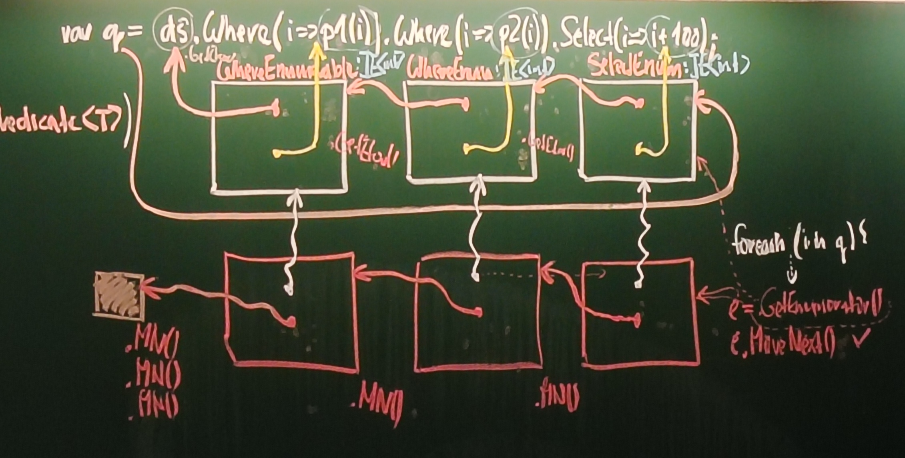

# 10. přednáška, pokročilý c#
## delegáti pokračování
- chtěli jsme minule kus algoritmu vytáhnout jinam, parametrizovat ji delegátem
```
class A
    ProcessList() {
        int index = list.FindIndex(GreaterThanFive)
    }
    private static bool IsGreaterThanFive(int x) => x >5
```
- mohlo by se stát, že změním vnitřek metody `GreaterThanfive` třeba na $7$, ale zapomenu upravit název
- nebo na to někdo sáhne, nebo si ji použije někde a tím přestane být implementačním detailem
- věci pro jeden řádek nám leakují dál do kódu, to nechceme
<br>--> **lambda funkce**

## lambda funkce - "anonymní funkce"
- má jméno na úrovni CIL, ale je generováno překladačem, je tam vnímána jako normální funkce
### základní koncept
- `static [parametry] => [tělo]`
- **pozor!! jen ta šipička neznamená lambda funkci!!!**, je to prostě zkrácený zápis, lambda funkci poznám z toho, že tam není název funkce
```
class A
    ProcessList() {
        int index = list.FindIndex(static (int x) => {return x > 5;})
    }
```
- v téhle fázi je to jen syntaktik šugr
- v prehistorii (C# 3) se tam psalo `static delegate [parametry] => [tělo]`
- může být i voidová `static (int x) => x + 1`
- nemusí mít typ parametry `static x => x + 1`, v CIL je to otypováno implicitně překladačem
- nemusí mít parametry `static () => Console.WriteLine("kokos")`
- buď musí mít všechny parametry určený typ, nebo žádné (nejde `(x, int y)`)
- může se dosadit do delegáta `Func<int,int> f1 = static x => x + 1`, implicitně to tam překladač pošéfí
- `Func<int,double> f1 = static x => x + 1` OK - je konverze, překladač si ji v kódu vygeneruje, vznikne `double <parent>b__0_0(int x)`
- `Func<double,int> f1 = static x => x + 1` BAD - není implicitní konverze z double na int, vzniklo by `int <parent>b__0_0(double x)`
- `Func<double,int> f1 = static x => (int)x + 1` - OK
- **nedá se explicitně zvolit typ návratové hodnoty v lambda funkci!**
- lambda funkce kvůli statičnosti nemá stav
### příklad - mapování, jak to překladač dělá
```
public static class Seuence {
    public sttaic IEnumerable<S> MapAll<T,S>(this IEnumerable<T>, mapper něco s S)
}


List<Customer> customers = GeCustomerList();
IEnumerable<string> names = customers.MapAll(static c => c.name)
```
- překladač tam dělá poměrně netriviální práci
```
IEnumerable<string> names = Sequence.MapAll(customers, static c => c.name)
```
```
Sequence.MapAll<Customer, S>(customers, static c => c.name)
```
```

Sequence.MapAll<Customer, S>(customers, static (Customer c) => c.name)
```
zkusí string
```
Sequence.MapAll<Customer, string>(customers, static (Customer c) => c.name)
```
funguje, hurá
- musí být ale jasná cesta
- dal by se tam použít object, ale bylo by to k ničemu
----
----
## relační databáze
- když bereme kolekci jako množinu dat
- je to tabulka s řádky a sloupci
- jeden řádek reprezentuje jednu entitu, v programu by to byla jedna instance třídy, třeba Person
- tabulku lze vnímat jako kolekci těch entit
- **SQL query** se dotazují té tabulky, třeba
  - `SELECT * FROM PEOPLE WHERE Age>=18`
  - neříkají algoritmus, jak to dělat, takže ten server si to musí nějak efektivně vyřešit, popisujeme to deklarativně
  - tahle myšlenka deklarativního zápisu dává smysl i jinde v programování
  
## LINQ - Language Integrated Queries
- **na úrovni C# je to pouze syntaxe**, nedefinuje to žádnou sémantiku
- definuje to, co můžeme zapsat, ale ne, co to znamená🙃
- `from x in [zdroj_dat] [klauzule A B C]`
- x je pseudoproměnná reprezentující entitu
- jako kdyby to byl 
```
JEN PŘEDSTAVA!!!!
foreach (x in [zdroj_dat])
    x -> A -> B -> C --> výsledek
```
```
from c in customers where c.City == "London"" select c.Name
přeloží se na
customers.Where(c=> c.City == "London").Select(c=>c.Name)
```
- **C# jen garantuje, že to nahoře se přeloží na to dole, to dole se ale musí přeložit stejně jako kdybychom napsali rovnou to dole**
- parametry těch vnitřních lambda funkcí nejsou sdílené a je úplně jedno, jak se jmenují
### sémantika LINQ
- můžeme si napsat vlastní
#### příšery
```
class Creature {
    public string Name {get; set;}
    public int OrderBy(Predicate<Creature> predicate) {
        if (predicate(this))
            zabij příšeru
            return 1
        else
            nech ji žít
            return 0
    }
}

var emilCreature = new Creature {Name = "Emil"}
var shelobCreature = new Creature {Name = "Shelob"}

int creaturesKilled = from c in emilCreature orderby c.Name.StartsWith("S") select c;
// emil přežije
int creaturesKilled = from c in shelobCreature orderby c.Name.StartsWith("S") select c;
// shelob umře
```
- ty metody mohou vracet cokoli, musím ale při řetězení mylse tna to, na čem se nám ty predikáty vlastně volají
- třeba pokud `Where` na `Nothing` vrátí `int` a já na tom volám zase `Where`, tak se to nepřeloží, protože `int` nemá `Where`
- ta kasakáda funkcí prostě musí být validní
- zase jednou překladový duck-typing
### LINQ to Objects 
- předpřipravená sada extension methods
- `using System.Linq`
```
static class Enumerable {
    Where <T>(this IE<T>, Predicate<T>)
}
```
- jsou to externí metody, nerozumí implementačním deailům
- pokud si napíšeme vlastní metodu, použije se ta, protože extension metody se hledají až jako poslední)
<br> `var q = ds.Where(...).Where(...).Select(...)`
- operátory se dělí na dvě kategorie
  - deffered execution 
  - 
### deffered execution
  - zavolá se metoda, ale neudělá se ta věc
  - třeba `Where` nefiltruje, ale vyrobí objekt nějakého typu `WhereEnumerable`, který si pamatuje referenci na zdroj
  - pak se zavolá metoda `Where` zase na tom `WhereEnumerable`, má dokaz na svůj zdroj
  - na to se volá `Select`, vyrobí `SelectEnumerable`, má odkaz na svůj zdroj
  - zatím nikdo nevolal delegáty ani se neptal kolekce, co má
  - tyhle objekty iplementují `IEnumerable<to co vracím>`
  - uděláme:
  ```
  foreach (i in q) {
      e = getEnumerator() na ten SelectEnumerable
      e.MoveNext()
          zdroj.getEnumerator() tedy na druhy WhereEnumerable
          volám na něj MoveNext()
              zdroj.getEnumerator() tedy na prvni WhereEnumerable
              volám na něj MoveNext()
                  zdroj.getEnumerator() enumerator dataSourcu
                  volám na něj MoveNext()
  }
  ```
  - všechno si to pamatuje reference na to další
  - vrácené věci se z hlubiny propagují nahoru, když nesplní něco v polovině, opajue se volání `MoveNext()` dole
  - je to **lazy evaluation**
  - ne všechny metody se takhle mohou volat, třeba `OrderBy` nedává smysl


<br>
#### na pořadí záleží
- když dám `Where` a za to `OrderBy` - nejdřív vybere, pak třídí
- když dám `OrderBy` a za to `Where` - nejdřív třídí vše, pak vybírá
- první možnost je rychlejší
- při volání na jiné věci definované se jen vyrobí nová krabička, která ukazuje na konec řetízku
     


