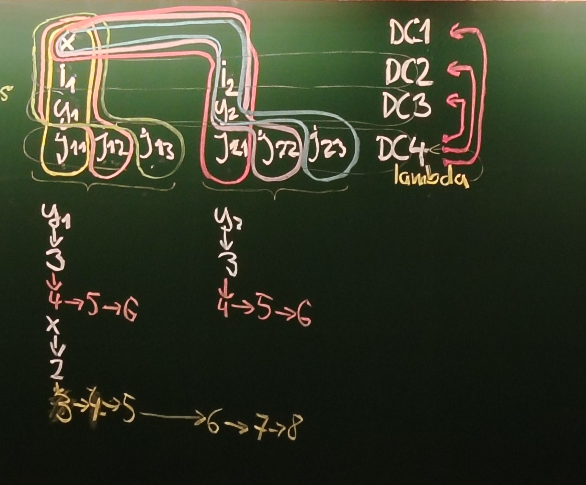

# 11. přednáška
### hledání druhého maxima
- triviálně sekvenčně, prostě to procházím a udržuju si hodnoty
- `ForEach` **lambda výrazem**

```
values = List<>...
values.ForEach(v => {
    if (v > max) {
        max2 = max1
        max1 = v
    }
})
```
## životnost proměnných v lambda výrazech
- životnost scope nesouvisí s lambda výrazem
- normální proměnné žijí v bloku `{}`
```
{
    int a =
    int b =
    int c =
    {
        int k =

        tady umře k
    }
    //tady umře a,b,c
}
```
> Scope je DisplayClass pro překladač
```
{
    int a =
    int i = // i a j jsou poskvrněné lambdou
    int j = // jdou spolu do scopeu DC1
    {
        int k = // jde do scope DC2
        () => i + j + k

        //tady umře scope DC2
    }
    tady umře a a scope DC1
}
```

```
for (x ...)
    int i = 0
    for (y ...)
        int j
        actions.Add(() => ++i, ++j, ++x, ++y)


x                               DC1
i1              i2              DC2
y1              y2              DC3
j11 j12 j13     j21 j22 j23     DC4 - tady je i funkce

// jsou to různé proměnné, lambda funkce zachytává ty konkrétní proměnné pod jmény x, i, j, y
```


- nahoře každá closure pro jednotlivé iterace má jinou sadu proměnných, jsou zachycené v různých scopech, mají tedy různé životnosti
- lambda funkce bude v `DC4`, ale má reference na ostatní scopes relevantní pro aktuální iteraci
### co když přidáme další lambda funkci
```
for (x ...)
    int i = 0
    for (y ...)
        int j
        actions.Add(() => ++i, ++j, ++x, ++y)
        actions2.Add(() => --i, --j, --x, --y)
```
- na vytvareni scopu se nic nezmění, životnost to nijak neovlivní
```
for (x ...)
    int i = 0
    for (y ...)
        int j
        actions.Add(() => ++i, ++j, ++x, ++y)
        actions2.Add(() => --i, --j, --x, --y)

actions3.Add(() => i) // tahle bude v DC2
```
- jinak se na životosti nic nemění
### capture by accident
- když najedu na šipičku, ukáží se mi zachycené proměnné
```
int i = 42 
Action {
    int i = 5
    lambda pracující s i
}
tady se zachytila ta 42
```
- můžu tomu zabránit, když dám lambdu static

## vlááááááááákna
thread:
```
Main()
    ...
    f()
        ...
        g()
        ...
```
**vlákno** - má stav zásobníku, svoje proměnné<br>
**proces** - celý program, má kód, globální proměnné, haldu<br>
### jak simulovat pro uživatele souběh
```
Main()
    A();
    B();
```
- aby to probíhalo na oko současně
- rozdělit na úseky po 100ms a střídat
- **coroutine** pomocí `yield return`
- **cooperative přepínání**
> počítač náprav
#### jaké to má výhody oproti vícevláknovému programování?
- máme kontrolu nad tím, co se kdy dělá
- známe pořadí
- definujeme si sami bloky, které se nepřerušují
#### nevýhody
- když se nic neděje, tak pořád využíváme stejně procesoru
- u stavědla to nevadí, u normální aplikace ano
- nemáme prostě pasivní čekání
- nevyužijeme více jader procesoru
#### `Thread.Sleep(ns)`
- neznamená, že se rozběhne po té době, ale že po té době bude připraven k běhu
#### `System.Threading`
#### `Thread`
- instance reprezentuje vlákno
- preemptivně přepínaná vlákna
- má statickou vlastnost `.CurrentThread` a tím dostaneme volající
- `ManagedThreadId` - unikátní identifikátor v daném procesu, můžu porovnávat v rámci jednoho spuštění procesu, principiálně neodpovídá id vlákna v operačním systému
### jak vzniká vlákno
- **takhle ne** `var t = new Thread()`, to mi udělá jen builder, můžu fluentně nastavit nějaké vlastnosti, třeba `IsBackground`
> proces končí až doběhnou všechna vlákna na popředí, nicméně lepší než zabíjet vlákna na pozadí je ukončit je nějak humánně
- `var t = new Thread(delegate void ThreadStart())`
- `var t = new Thread(delegate void ParametrisedThreadStart(object o))`
- `t.Start()` nebo `t.Start(object o)`, **teprve teď se doopravdy vyrobí vlákno a "spustí se"**
- má vlastnost `State`
  - na počátku `Unstarted`
  - po zavolání `Start` je ve stavu `Running`, ale to neznamená, že běží, z pohledu OS může být jen `ready to run`
  - když doběhne, tak "`ended`", pro OS `terminated`
  - ještě stav pro OS `waiting`, v .NET něco divného


### když chci čekat, až nějaké vlákno skončí
  - `while(t.IsAlive) čekej` - to je ale **aktivní čekání**, to nechceme, co kdyby to vlákno, na které čekáme, čeká na uvolnění našeho jádra
  - `Thread.Yield` - **semiaktivní** - vzdávám se procesoru, ale chci být ready to run, pokud nikdo nechce moje jádro, vezmu si ho zpět, varábím tím špatné preemptivní přepínání [viz dále](#kooperativní-vs-preemtivní-přepínání)
  - a teď to **pasivní**
#### pasivní čekání
- operační systém má množinu podmínek
- jedna je, až nějaké jiné vlákno zterminuje
- `t.Join()`, na volající vlákno čeká `t` (aspoň myslím)
  
### kooperativní vs preemtivní přepínání
- v preemptivním se to děje be znašeho vědomí, přepíná se do supervisor režimu, volá se kód kernelu, zpátky, trvá to
- nechci dělat kontext-switch často, dělá se to asi po 1-10ms

### modifikace sdílených struktur
- co když se to zrovna blbě přeruší, nebo běží jinde a sahají si na struktury
- sdílené struktury jsou všechny globální a celá halda
- **race-condition**
- bez vláken zařídíme `yield return`em
- thread-safe struktury