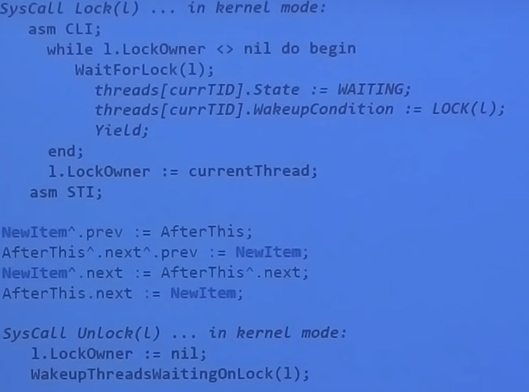
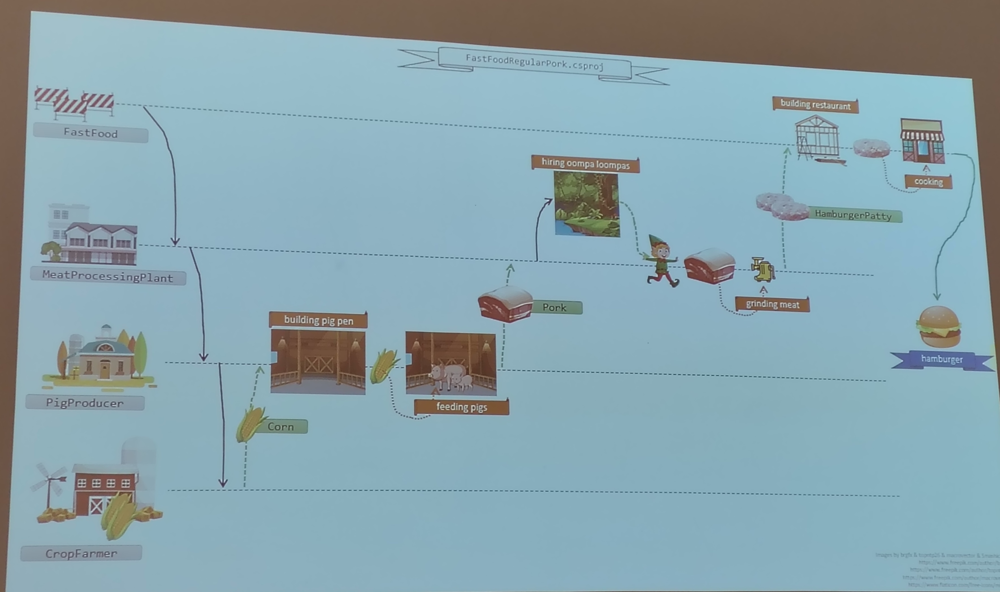
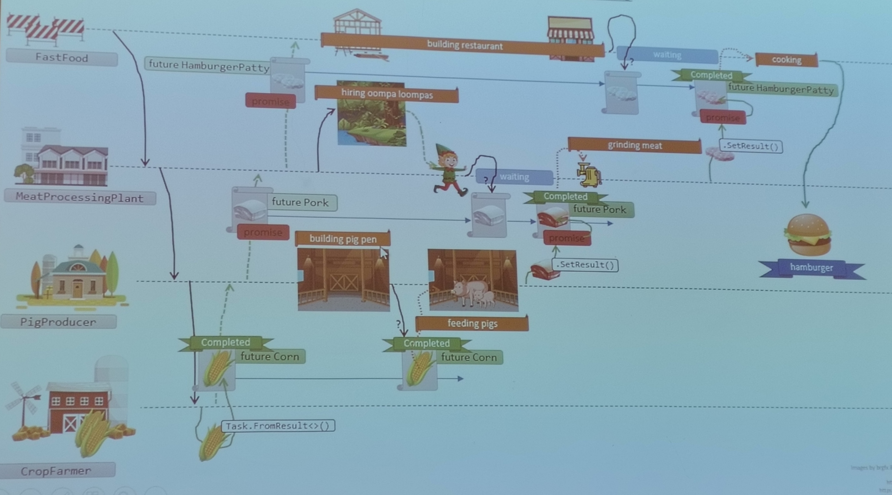

# opakování z Počítačových systémů

## příklad - vkládání do dvouměrného spojáku
```
T1: NewItem -> Prev = AfterThis;
T1: AfterThis -> Next.P = NewIem
T1: NewItem -> Next = AfterThis->Next
T1: AfterThis.next = NewItem
```
- problém by byl ve vícevláknovém prostředí s preemptivním přepínáním vláken
### co kdyby tam chtěla přidávat dvě vlákna
- proběhly dva kroky algoritmu `T1`
- OS udělal přerušení a spustí vlákno T2
```
T1: NewItem -> Prev = AfterThis;
T1: AfterThis -> Next.P
############## CONTEXT SWITCH ###############
    T2: OtherItem -> Prev = AfterThis;
    T2: AfterThis -> Next.P = OtherItem
    T2: OtherItem -> Next = AfterThis->Next
    T2: AfterThis.next = 
############## CONTEXT SWITCH ###############
T1: NewItem -> Next = AfterThis->Next
T1: AfterThis.next = NewItem
```

- a dopadne to takhle, přestože původní algoritmus je zcela správně
- nicméně my porušujeme předpoklady toho algoritmu
- možné řešení by bylo při **kooperativním přepínání vláken** prostě tam nevolat ten yield, ale máme preemptivní systém
- došlo nám k **race condition** v **kritické sekci**
- můžeme vypínat a zapínat hardwarová přerušení, vložit ty instrukce kolem kritické sekce, **ale!**
    - v C# tam nemůžu prostě napsat kus strojového kódu kvůli multiplaformnosti
    - tyhe instrukce jsou typicky privilegované a je **zakázáno je použít v uživatelském režimu**
### zámky
- struktura má zámek, ten  zamknu a pak odemknu
> ale to by nám stejně nepomohlo ve víceprocesorových systémech
- vnitřek se potom **provádí atomicky**
- mám tam cyklus, který probouzí ostatní vlákna, cyklus je lepší než if, rotože nějaké vlákno se mnou se probudivší by mi mohlo vyžrat ten procesor a já bych si toho nevšimla

- imlementace zámků v .NET podporuje rekurzivní zapínání zámku a poud zámky nemají vlastníky, tak se v uživatelském zamkne, pokud ho cheme zamknout rekurzivně, jen si zvýší počítadlo, takže se omezuje volání funkcí kernelu
- neúspěšná zamykání mají velký overhead, probouzení vláken taky
### souboj o zámek
- mám tři jádra
- T1 zamkne zámek
- T3 to zkusí a neupěje, pasivně čeká
- T2 to zkusí a neupěje, pasivně čeká
- T1 se odemkne
- všechna **vlákna se probudí do READY TO RUN, nerozběhnou se rovnou**, při kontext switchi se může jedno z nich naplánovat
- OS naplánuje T2 stihne se zkontrolovat cyklem, zamknout a rozběhnout
- OS naplánuje T3 stihne se zkontrolovat cyklem a zase chudák začne pasivně čekat
- kdyby T1 začalo taky čekat, tak nám nikdo negarantuje, že nás T1 nepředběhne a T3 nebude čekat dál

# 12. přednáška
## ThreadPool
- bazén úložek, které je teba udělat
- vlákna si je rozebírají
- statická třída
### vložení - `ThreadPool.QueueUserWorkItem(Action<object> object)`
- `void WaitCallbackObject(object)`
- je **asynchronní, hned se vrátí, ale to neznamená, že ta úložka se hned provedla, jen se zařadila do fronty**
### nevýhody
- když bude něco, co trvá dlouho, tak je asi lepší na to udělat separátní vlákno, aby to neblokovalo pool
- stejně tak tam nechceme dávat věci, které volají `Join` a pak pasivně čekají na jiné vlákno
## Parallel
- nadstavba ThreadPoolu
- **všechny metody synchronní**, vrací se teprve po tom, až si to nějaké vlákno vezme, tu úložku, a vyřeší ji
- `Parallel.InvokeItem(params Action[] action)` etc
- **nevloží to všechny delegáty do Threadpoolu najednou**
## příklad s FastFoodem

- objednám si placičky
- dodavatel čeká na svého dodavatele a dál řetěz dodavatelů
- takže náš FastFood strašně dlouho čeká na placky a přitom během toho mohl klidně stavět třeba
- co kdybych ale měla postaveno a nepřišlo maso - řešení **futures**
## futures
- nedostanu vepřové, ale budoucí vepřové, tedy slib, že vepřové bude
- takže nechci, aby metoa dlouho čekala a pak vrátila `T` kukuřici, ale raději ať hned vrátí `Task<T>`, tedy budoucí kukuřici
- je to asynchronní metoda, dává se přípona **async**
- jak z toho dostanu skutečnou kukuici? má o vlastnost `.Result`
- je tam i metoda `.Wait()` vrací bool `.IsCompleted`
#### zpět do příkladu, jak využít futures
- `Task.FromResult<T>(T__)` vrátí mi to budoucí kukuřici, která je hned naplněna, je to dobré k tomu, že ta metoda je obecně asynchronní, ale někdy můžu rovnou vrátit tu věc, jind zruššit objednávku a tak
- můžu mít i `Task<void>`, pořád je tam výsledek, jestli doběhlo, třeba rozorání pole
### další příklad
- `R = f1() + f2()`, kde f jsou pomalé
```
task1 = f1Async();
temp2 = f2();
R = task1.Result + temp2
``` 
- vlastně
```
task1 = f1Async();
temp2 = f2();
task1.Wait()
temp1 = task1.Result
R = temp1 + temp2
``` 
- nebo
```
task1 = f1Async();
task2 = f2Async();
R = task1.Result + task2.Result
``` 
- result1 je dřív, pak se čeká na result2, čeká se, jsou tam context switche, neefekttivní
- metoda `Task.WaitAll`
```
task1 = f1Async();
task2 = f2Async();
Task.WaitAll(task1, task2)
R = task1.Result + task2.Result
``` 
- probudí všechna vlákna až po doběhnutí všech, nebudí je zbytečně v průběhu
- existuje i `Task.WaitAny()`
## promise
- kromě future pořebujeme ještě **promise** v .Netu `TaskCompletionSource<T>`
- future je, že si něco objednám
- promise je, že ode mne bylo něco objednáno
- `.SetResult(T result)`
- má vlastnost `.Task` kde je reference na task, můžu tam nastavi, že je completed
- **promise je write only**
- **task je read only**

## zpět fastfood

## co když nejsme schopni naplnit future?
- task má `.IsCanceled`, promise má `.SetCancelled()`
- **ale `IsCancelled` je zároveň `IsCompleted`**
- **`IsCompletedSuccessfully`**
- co se stane, když zavolám result na cancelled věc
- "vyšíří se **OperationCancelledException**" reálně ne, přijde `AggregateException` má `.InnerExceptions` vždycky je to zabalené v té kolekci, může záviset na hodně úlohách a nechci zagregovat chyby do jedné
## co když nastane v tasku chyba
- co když je v programu bug a vznikne v úložce threadpoolu random výjimka, vlákno se nechce nechat zabít
- v threadpoolu se výjimky ignorují a nezabíjí to vlákno
- **chceme dát threadpool do catch blocku a chytat vše, aby se nám výjimky neztrácely**
- task má `IsFaulted` ještě
- promise má `SetException(Ex...)`
- ten, kdo drží promise zjistil chybu
## co když chci zrušit future `struct CancellationToken`
- **read only**
- už nepotřebuju o vepřové
- předává se hodnotou
- `IsCancellationRequested`
- navrženo pro **kooperativní cancellování**
- token se pořád ptá kódu, jestli je requested
## `ref CancelationTokenSource`
- **write only**
- vnímejme `CancellationToken` jako future a `CancelationTokenSource` jako promise
- `.Token` vykopíruje se hodnotou¨
- `CancellationToken` má referenci na `CancelationTokenSource`, ale je privátní
- teď už se nemusí token pořád ptá, ale když se někdo ptá jeho, zeptá se svého source

# sdílené datové struktury
- [viz výše pro podrobnější](#-opakování-z-Počítačových-systémů)
- race condition
- kritické sekce
- mutual exclusion
- zámky
## zámky
- tída má overhead, součástí je odkaz na syncblock
- syncblock má dvě části - **zámek a něco**
- by default je syncblock null
- vlastník zámku (vlákno)
- fronta čekajících (ne nutně fronta)
## Monitor
- `.Enter(object o)` - to je zamykání
- když je syncblock null, vyrobí ho
- nastaví ten zámek, volající vlákno jako vlastníka
- `.Exit(object o)` - nesmí to držet jiné vlákno, nesmí být null
- dá se rekurzivně pomocí počitadla

### alternativní zápis - lock
```
lock(object) {

}
```
- volá se tam ten monitor, ale hlídá mi to spárování
- ale samozřejmě nesmysl používat, pokud se mají křížit ty složené závorky, ty situace bývají obecně ošemetné
### potenciální chyby
- pracuju se zamčenou proměnnou a dosadím do ní jinou instanci, druhé vlakno mi ji pak může zamknoutt, protože zámek je na instanci ne na proměnnou
- vyrobím si separátní objekt `datalock` pro ty `data` a zamykám ten, není to nikde napsané, musím mít tu myšlenku

