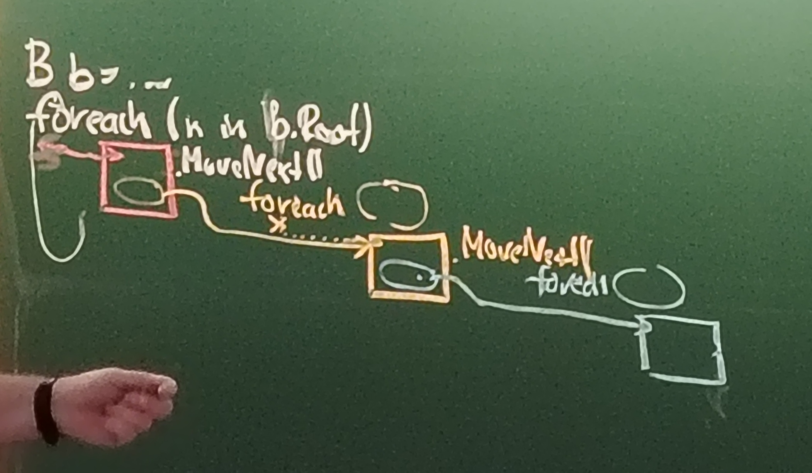

# 9. přednáška
### procházení stromu enumerací
```
B : IEnumerable<int>
  .GetEnumerator() --> IEtor<int>
                        .MoveNext()
```
- vypadá to krásně jako sekvenční průchod stroemm, když si naimplentuju GetEnumerator
- v každém kroku foreache se při MoveNext přidávají odkazy na další enumeráory, vniká cesta enumerátorů

- je to strašný overkill, přibývá hromada enumerátorů
- chceme to udělat nějak lépe
- můžeme jakožto programátoři nové třídy A využívající B úplně zničit člověka, který programjue B tím, že pro svoje účely po něm budeme chtít pořád další funkce, třeba průchod do indexu 5 etc
### dva přístupy
```
A:
  foreach
    MoveNext z B
      podmínka
```
nebo
```
B:
  indexOf ...
    while ...
      ...
      podmínka A
      ...
```
- můžeme použít rozhraní `IComparable` na podmínku, ale spíš by se nám hodilo hypotetické `IComparision<T>` s `bool Compare<T x>`, porotže nemáme ten druhý člen z `IComparable Compare(T x, T y)`
> připomenutí: **IComparision je fiktivní**
```
A : IComparision<int>
```
- **to nechceme** - rozšiřovali bychom tím kontrakt, ale je to implementační detail
```
:::uvnitř A:::
private class LessThan5 : IComparision<int> {
  bool Compare(int i)
    return i < 5;
}
```
- zase je overkill tam pořád vyrábět instance té privátní třídy
## delegáti
- chytré pointery na funkce
- striktně referenční typy
- může být i vhnízděný
```
delegate int D (string s);
D d = default; <=> null
D d = new D(m)
            ^^ m je odkaz na metodu
            !!! NE m(), to je volání
```
- dědí od `System.MulticastDelegate`
- má pointer na skutenou metodu, je to typu `nint` (natural int dle architektury), nedá se na to sahat
> konvence: delegátům se dává přípona *Delegate*
```
delegate int BinaryOpDelegate(int a, int b);
static int Add(int a, int b) =>  a + b;

var d1 = new BinaryOpDelegate(Add)
d1(2,3); 
// to stejné jako 
d1.Invoke(2,3)
```
- pro konkrétní typ delegáta se vygeneruje metoda `Invoke(navratova_hodnota)`, narozdíl od normálního použií je tady typ známý, nic se neboxuje, žádné harakiri se neděje
- můžeme ji volat bud explicitně, nebo se volá sama skrytě
- **delegáti jsou imutable**
- je teda možné nechat si v cache instance delegátů, vím, že se mi nebudou měnit

> syntaktická zkratka
> ```
> d = new D(m) // nová instance
> d = m //nějaká instance, třeba i cacheovaná
> ```
> je to skoro to samé
> <br> je třeba na to myslet, pokud používám instanci delegáta jako klíč
- různí delegáti nejsou obecně spolu kompatibilní
#### můžu dosadit podobného delegáta?
- ne, i kdyby seděl typ a parametr
#### do teď jsme do delegátů dávali veřejné statické metody, jde to jinak?
- pokud ji delegát nevidí, nejde to
- například `A` má privátní metodu, uděláme v něm statickou metodu, která vrátí delegáta na tu metodu, teď můžeme přistupovat přes toho delegáta k té privátní metodě. Zda je to dobře, toť otázka
#### zpět k prvnímu příkladu
- `A` privátní metodu, delegát na ni se předá `B` a to si to tam může používat
#### co když chceme dát do delegáta instanční metodu?
```
class A
  void f(int x) // je vlastně void f(this A, int x)
```
- volající delegáta teda musí vědět to this
- delegátt si pamatuje pointer na metodu a this
- mohlo by se to hodit, kdyby v prvním píkladu nebylo méně než 5, ale méně než nějaký field `A`
- `Delegate d = new Delegate(A.f)`
- je ale imutable, takže to this už pak nejde změnit, pokud se tam třeba dosadila do té proměnné jiná, delegát se nezmění
- pokud je delgát null, pak hází při opracích výjimku a není to prázdná operace, jak by si člověk mohl myslet
### delegate bool Check\<T>
- `Check<int>` a `Check<string>` nemají nic společného
### obecní delegáti?
- v dotnetu jsou připravení delegáti s hromadou variant ohledně počtu parametrů až pro dvacet
-  `delegate void Action<T1, T2...> (T1 arg1, T2 arg2...)` 
- `delegate TResult Func<T1, ... , TResult>(T1 arg1, ..)`
- `delegate bool Predicate<T>(T obj)`
- pozor na to ale, často nás to zavede do pekla
- zvlášť když mají funkce hodně parametrů a je to nejasné, je lepší to silně typovat
#### delegáti a var 
```
var a = 5;
^^ nemusí být přehledné
var d = new D(m);
^^ taky funguje --> D d = new D(m)
ale co když použiju zkrácenou syntaxi
var d = m;
^^ dříve se nepřeložilo 
^^ nově se přeloží jako natural delegate type, jeden z obecných výše
```
#### delegát má v sobě `.Method`
- umí vrátit method info
- ale trvá to strašně dlouho oproti reflection, pro cacheované ne, když ho tam poprvé zavoláme, tak se nám tam uloží pro příště
- můžu volat metodu přes method info, je to ale velmi pomalé
- `methodinfo.CreateDelegate<T>` vyrobení trvá dlouho, ale potom je to mnohem rychlejší, než volat metodu přes method info
- nefunguje to pro fieldy ale....
  
#### jak moc delegáti zpomalují?
- výsledky sady benchmarků
- doba vyrobení delegáta nezávisí na funkci
- je nepřekvapivě pomalejší, ne výrazně u krátkých metod

---
## serializace - pokračování z 8. přednášky
### jak zeserializovat privátní fieldy?
- mohlo by se hodit pro deep cloning - vyrobení nové instance
- každý objekt má `protected .MemberwiseClone()`, která dělá shallow copy, jen se ukazuje na už existující věci
- použijeme `TypeInfoResolver`, vyžaduje seznam delegátů, můžeme si to udělat pomocí vlastní metody, můžeme pro private fieldy vygenerovat fakeové vlastnosti, tím to obejdeme
- pozor na to, že JSON si nepamatuje typové informace
- to se vyřeší tím, že to pidáváme přes vlatnosti a gettery a settery si to ošetří

### ukládání coroutines
```
krok1
krok2
krok3
```
- nechceme to vnímat jako prvky, ale jako kroky algoritmu
- algoritmus explicitně rozdělelný do kroků = **coroutine**
- chci mezi ně narvat `yield return`
- třeba ve hrách na NPC by se to mohlo hodit
- instance enumerátoru reprezentuje stav coroutine, je to v privátních fieldech enumerátoru
- `MoveNext()` dělá roky algoritmu
- kdybychom si chtěli hru uložit v tom stavu, hodilo by se nám uložit stav enumerátoru, zaserializovat ho
- jde to, ale neuloží se typ enumerátoru, to už ale můžu vědět já, do čeho to pak chci dát

