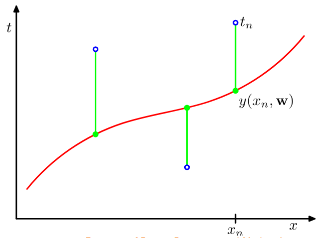
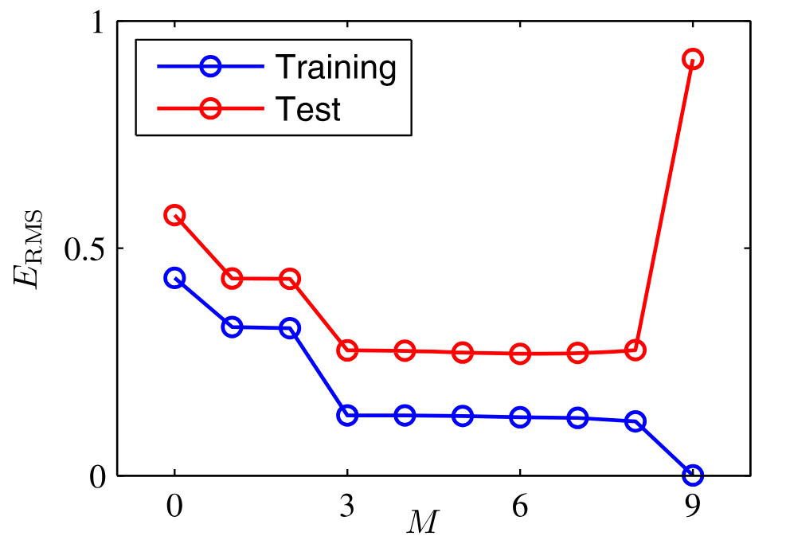

> Úvod do strojového učení v Pythonu 2025/26 
> https://ufal.mff.cuni.cz/courses/npfl129/2526-winter#home 
> https://github.com/ufal/npfl129

# LINEÁRNÍ REGRESE
Pro daný vstup $x \in \mathbb{R}^D$ 

$$
y(x; w, b) = x_1 w_1 + x_2 w_2 + \dots + x_D w_D + b 
= \sum_{i=1}^D x_i w_i + b 
= x^T w + b
$$

- $w$ - **váhy**  
- $b$ - **bias** (posun)

**rozšířený vektor vstupů** 
Vstupní vektor $x$ lze rozšířit o hodnotu $1$ a pak uvažujeme pouze výraz $x^T w$, kde je bias zakódován jako poslední váha, takže pojem **váhy** často zahrnuje jak váhy, tak i bias

## trénink
**Mám** dataset $N$ vstupů $x_1, \dots, x_N$ a cílové hodnoty $t_1, \dots, t_N$.  
**Chci** najít váhy $w$ tak, aby se minimalizovala **chybová funkce** mezi skutečnými cílovými hodnotami a jejich predikcemi.
### střední kvadratická chyba (MSE)
- jedna z nejjednodušších 
$$
\text{MSE}(w) = \frac{1}{N} \sum_{i=1}^N \big( y(x_i; w) - t_i \big)^2
$$
- časté místo MSE **sum of squares** s  $1/2$:

$$
E(w) = \tfrac{1}{2} \sum_{i=1}^N (y(x_i; w) - t_i)^2
$$
- minimalizace $E(w)$ je ekvivalentní minimalizaci MSE (liší se konstantou)  
- $1/2$ se zavádí proto, aby byl gradient hezčí

$$
\nabla_w E(w) = \sum_{i=1}^N (y(x_i; w) - t_i) \, x_i
$$

 

## minimalizace chyby
- pro lineární regresi se **sum of squares** chybou existuje explicitní řešení  

**chci** minimalizovat:
$$
E(w) = \tfrac{1}{2} \sum_{i=1}^N (x_i^T w - t_i)^2
$$
---
#### Maticová formulace
Označme:
- $X \in \mathbb{R}^{N \times D}$ matici vstupů, kde na řádku $i$ je $x_i$  
- $t \in \mathbb{R}^N$ vektor cílových hodnot  

Pak můžžeme chybu zapsat jako:

$$
E(w) = \tfrac{1}{2} \|Xw - t\|^2
$$

protože:

$$
\|Xw - t\|^2 = \sum_i \big((Xw - t)_i\big)^2 
= \sum_i \big((Xw)_i - t_i\big)^2 
= \sum_i (x_i^T w - t_i)^2
$$

### explicitní řešení
Hledáme minimum funkce
$$
E(w) = \tfrac{1}{2} \sum_{i=1}^N (x_i^T w - t_i)^2
$$

chceme hledat body, kde **derivace chybové funkce podle všech vah $w_j$ je nulová**:

$$
\frac{\partial}{\partial w_j} \tfrac{1}{2} \sum_{i=1}^N (x_i^T w - t_i)^2 
= \tfrac{1}{2} \sum_{i=1}^N 2 (x_i^T w - t_i) x_{ij} 
= \sum_{i=1}^N x_{ij} (x_i^T w - t_i)
$$

Proto pro všechny $j$ chceme:

$$
\sum_{i=1}^N x_{ij} (x_i^T w - t_i) = 0
$$
---
#### maticová formulace
můžeme zapsat jako:
$$
X_{*,j}^T (X w - t) = 0
$$
pro všechna $j$ dohromady v maticové notaci:
$$
X^T (X w - t) = 0
$$
dostaneme:
$$
X^T X w = X^T t
$$
$X^T X$ má rozměr $D \times D$, pokud se dá invertnout, můžeme vyřešit explicitně:
$$
w = (X^T X)^{-1} X^T t
$$

## algoritmus
### Vstup
Dataset:
- $X \in \mathbb{R}^{N \times D}$ — matice vstupů  
- $t \in \mathbb{R}^N$ — vektor cílových hodnot

### Výstup
- váhy $w \in \mathbb{R}^D$, které minimalizují MSE

### Postup
$w \gets (X^T X)^{-1} X^T t$

### složitost 
- $O(N D^2)$, za předpokladu, že $N \ge D$  
- pokud je matice $X^T X$ invertovatelná, můžeme rovnici $X^T X w = X^T t$ vyřešit pomocí SVD

## RMSE
- odmocnina z MSE pro grafy

