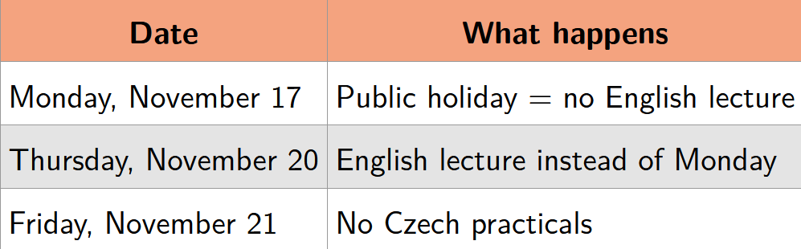

> Úvod do strojového učení v Pythonu 2025/26 
> https://ufal.mff.cuni.cz/courses/npfl129/2526-winter#home 
> https://github.com/ufal/npfl129

# info
- maximum 105
- nutné minimum 70
- bonusové body za soutěže
- body nad 70 + bonusové <=40 - navíc ke zkoušce
- zkouška je na 100 bodů, známkovací hranice jsou 60, 75, 90

 

# ÚVOD
## definice základních pojmů
### strojové učení
Program, který se učí ze zkušeností E s ohledem na určitou třídu úkolů T a měřítko výkonu P, pokud se jeho výkon při úkolech v T, měřený pomocí P, zlepšuje se zkušenostmi E.
#### Úkol (task) T 
- klasifikace: přiřazení jedné z k kategorií k danému vstupu
- regrese: vytvoření čísla x∈R pro daný vstup
- strukturovaná predikce, odšumování, odhad hustoty...
#### Míra (measure) P 
- accuracy, error rate, f-score...
#### Zkušenost (experience) E 
- supervised: obvykle datový soubor s požadovanými výsledky (štítky nebo cíle)
- unsupervised: obvykle data bez jakýchkoli anotací (surový text, surové obrázky...)
- zpětnovazební učení, semi-supervised learning...

### programování vs. strojové učení
#### programování
- formální popis problému
- jednoznačná sada instrukcí pracující s tím konceptem
#### strojové učení
- máme data a measure (míru)
- typicky nevíme, jak napsat kód
## základní úkoly (tasks) a pojmy
- předpokládejme vstup ${x∈R^D}$
### regrese  
- predikovat reálnou cílovou proměnnou ${t∈R}$ pro dané $x$

### klasifikace:
- za předpokladu pevně dané množiny $K$ tříd je cílem vybrat odpovídající štítek/třídu pro dané $x$.  
- můžeme predikovat pouze samotnou třídu nebo celou distribuci pravděpodobností všech tříd.
- 
### trénovací množina
- skládá se z příkladů (x, t)  
- příklady jsou generovány nezávisle
### optimalizace
- aby to bylo co nejlepší na trénovacích datech a zárobeň to umělo generalizovat na testovacích
  
### notace (pokus o co nejpřesnější přepis)

- a, $a, A$, A: skalár (celočíselný nebo reálný), vektor, matice, tenzor  
  - všechny vektory jsou vždy sloupcové vektory  
  - transpozice změní sloupcový vektor na řádkový, takže $a^T$ je řádkový vektor  
  - skalární součin vektorů $a$ a $b$ značíme $a^T b$  
    - chápeme to jako maticové násobení  
  - $\|a\|_2$ nebo prostě $\|a\|$ je eukleidovská (nebo $L^2$) norma  
    - $\|a\|_2 = \sqrt{\sum_i a_i^2}$

- $a, a, A$: náhodná proměnná (skalár, vektor, matice)

- $\mathbb{A}$: množina; $\mathbb{R}$ je množina reálných čísel, $\mathbb{C}$ je množina komplexních čísel
- $\frac{d f}{d x}$: derivace funkce $f$ podle $x$
- $\frac{\partial f}{\partial x}$: parciální derivace funkce $f$ podle $x$
- $\nabla_x f(x)$: gradient funkce $f$ podle $x$, tj.  
  $$\nabla_x f(x) = \left( \frac{\partial f(x)}{\partial x_1}, \frac{\partial f(x)}{\partial x_2}, \ldots, \frac{\partial f(x)}{\partial x_n} \right)$$

### jak vypadají trénovací data
- obvykle množina $X \in \mathbb{R}^{N \times D}$: kolekce $N$ instancí, z nichž každá je reprezentována $D$ reálnými čísly 
- v **supervised** máme pro každou instanci i cílovou hodnotu $t$
  - reálné číslo pro regresi, $t \in \mathbb{R}^N$  
  - třídu pro klasifikaci, $t \in \{0,1,\dots,K-1\}^N$
### předzpracování vstupu (preprocessing)
- algoritmy nepracují vždy přímo s původními daty $X$, úpravy nazýváme features  
> občas se předzpracované vstupy nazývají design matrix$\Phi \in \mathbb{R}^{N \times M}$, my tomu budeme říkat $X$

